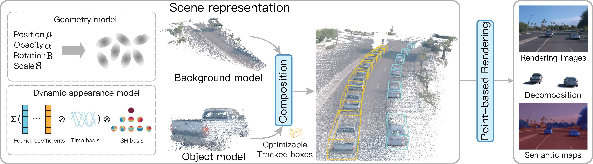

# Street Gaussians: Modeling Dynamic Urban Scenes with Gaussian Splatting

### [Project Page](https://zju3dv.github.io/street_gaussians) | [Paper](https://arxiv.org/pdf/2401.01339.pdf) | [Unofficial Implementation](https://github.com/LightwheelAI/street-gaussians-ns)

> [Street Gaussians: Modeling Dynamic Urban Scenes with Gaussian Splatting](https://arxiv.org/abs/2401.01339)  
> Yunzhi Yan, Haotong Lin, Chenxu Zhou, Weijie Wang, Haiyang Sun, Kun Zhan, Xianpeng Lang, Xiaowei Zhou, Sida Peng  
> ECCV 2024


https://github.com/user-attachments/assets/f28a64bd-9932-4447-b710-9254ae5ed56f

### Installation
<details> <summary>Clone this repository</summary>

```
git clone https://github.com/zju3dv/street_gaussians.git
```
</details>

<details> <summary>Set up the python environment</summary>

```
# Set conda environment
conda create -n street-gaussian python=3.8
conda activate street-gaussian

# Install torch (corresponding to your CUDA version)
pip install torch==1.13.1+cu116 torchvision==0.14.1+cu116 torchaudio==0.13.1 --extra-index-url https://download.pytorch.org/whl/cu116

# Install requirements
pip install -r requirments.txt

# Install submodules
pip install ./submodules/diff-gaussian-rasterization
pip install ./submodules/simple-knn
pip install ./submodules/simple-waymo-open-dataset-reader
python script/test_gaussian_rasterization.py
```
</details>

<details> <summary>Prepare Waymo Open Dataset.</summary>

We provide the example scenes [here](https://drive.google.com/drive/folders/1ghpE_kBwqXiWgiSWAajByjPsmj1y0l1H). You can directly download the data and skip the following steps for a quick start.

#### Download the training and validation set of [Waymo Open Dataset](https://console.cloud.google.com/storage/browser/waymo_open_dataset_v_1_4_1/individual_files?pageState=(%22StorageObjectListTable%22:(%22f%22:%22%255B%255D%22))). 
We provide the split file following [EmerNeRF](https://emernerf.github.io/https://emernerf.github.io/). You can refer to [this document](https://github.com/NVlabs/EmerNeRF/blob/main/docs/NOTR.md) for download details. 
<!-- Please note that `val_dynamic.txt` specify scenes from the validation set, which means you may need to change the file source [here](https://github.com/NVlabs/EmerNeRF/blob/8c051d7cccbad3b52c7b11a519c971b8ead97e1a/datasets/download_waymo.py#L31). -->

#### Preprocess the data
Download the tracking predictions on validation set, We provide the processed results [here](https://drive.google.com/file/d/1bMDOMtZdyP3m8qY1Phb5Sr6Po-QWFIWk/view?usp=drive_link).


Preprocess the example scenes
```
python script/waymo/waymo_converter.py --root_dir TRAINING_SET_DIR --save_dir SAVE_DIR --split_file script/waymo/waymo_splits/demo.txt --segment_file script/waymo/waymo_splits/segment_list_train.txt
```

Preprocess the experiment scenes
```
python script/waymo/waymo_converter.py --root_dir VALIDATION_SET_DIR --save_dir SAVE_DIR --split_file script/waymo/waymo_splits/val_dynamic.txt --segment_file script/waymo/waymo_splits/segment_list_val.txt
--track_file TRACKER_PATH
```

Generating LiDAR depth
```
python script/waymo/generate_lidar_depth.py --datadir DATA_DIR
```

Generating sky mask

Install GroundingDINO following [this repo](https://github.com/IDEA-Research/GroundingDINO) and download SAM checkpoint from [this link](https://dl.fbaipublicfiles.com/segment_anything/sam_vit_h_4b8939.pth).

```
python script/waymo/generate_sky_mask.py --datadir DATA_DIR --sam_checkpoint SAM_CKPT
```


</details>

<details> <summary>Prepare Custom Dataset.</summary>
TODO
</details>
<!-- 
### Configuration
We build the configuration based on [3D Gaussian Splatting](https://github.com/graphdeco-inria/gaussian-splatting/blob/main/arguments/__init__.py). 
The parameters used are listed in `lib/config/config.py` with brief comments. -->

### Training
```
python train.py --config configs/xxxx.yaml
```

Training on example scenes
```
bash script/waymo/train_waymo_expample.sh
```

Training on experiment scenes
```
bash script/waymo/train_waymo_exp.sh
```

### Rendering
```
python render.py --config configs/xxxx.yaml mode {evaluate, trajectory}
```
Rendering on example scenes
```
bash script/waymo/render_waymo_expample.sh
```

Rendering on experiment scenes
```
bash script/waymo/render_waymo_exp.sh
```

### Visualization
You can convert the scene at one certain frame into the format that can be viewed in [SIBR_viewers](https://gitlab.inria.fr/sibr/sibr_core).
```
python make_ply.py --config configs/xxxx.yaml viewer.frame_id {frame_idx} mode evaluate
```


### Pipeline


### Citation

If you find this code useful for your research, please use the following BibTeX entry.

```
@inproceedings{yan2024street,
    title={Street Gaussians: Modeling Dynamic Urban Scenes with Gaussian Splatting}, 
    author={Yunzhi Yan and Haotong Lin and Chenxu Zhou and Weijie Wang and Haiyang Sun and Kun Zhan and Xianpeng Lang and Xiaowei Zhou and Sida Peng},
    booktitle={ECCV},
    year={2024}
}
```
